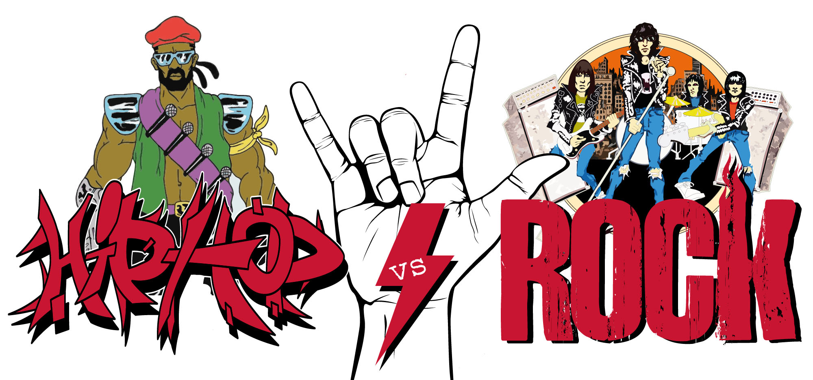
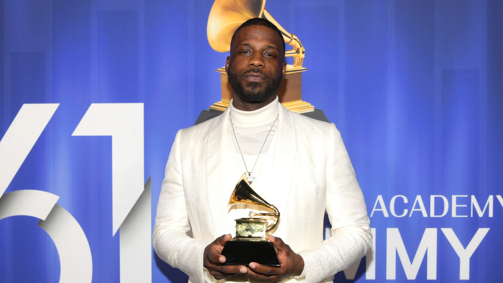

 
pic reference: http://www.gynesisradio.com/tfgrs/2018/01/06/hip-hop-vs-rock-2/

## Data information:
"lyrics_filter.csv" is a filtered corpus of 380,000+ song lyrics from from MetroLyrics. You can read more about it on [Kaggle](https://www.kaggle.com/gyani95/380000-lyrics-from-metrolyrics).

"info_artist.csv" provides the background information of all the artistis. These information are scraped from [LyricsFreak](https://www.lyricsfreak.com/).

Here, we explore these data sets and try to find interesting patterns.

```{r load libraries, warning=FALSE, message=FALSE,echo=FALSE}
packages.used=c("tidyverse", "tidytext","plotly","DT","tm","data.table","scales","wordcloud2","gridExtra","ngram","shiny","sentimentr","textmineR","tokenizers","rvest","tibble","rvest", "tibble", "sentimentr", "gplots", "dplyr","syuzhet", "factoextra", "beeswarm", "RColorBrewer","RANN", "topicmodels", "stringr","shiny","wordcloud")
packages.needed=setdiff(packages.used, 
                        intersect(installed.packages()[,1], 
                                  packages.used))

if(length(packages.needed)>0){
  install.packages(packages.needed, dependencies = TRUE)
}
library(tidyverse)
library(tidytext)
library(plotly)
library(DT)
library(tm)
library(data.table)
library(scales)
library(wordcloud2)
library(gridExtra)
library(ngram)
library(shiny) 
library(sentimentr)
library(textmineR)
library(tokenizers)
library(shiny)
library("rvest")
library("tibble")
library("syuzhet")
library("gplots")
library("dplyr")
library("syuzhet")
library("factoextra")
library("beeswarm")
library("RColorBrewer")
library("RANN")
library("topicmodels")
library("stringr")
library(wordcloud)
```
We use the processed data and artist information for our analysis.

```{r load data, warning=FALSE, message=FALSE,echo=FALSE}
# load lyrics data
load('../output/processed_lyrics.RData') 
# load artist information
#dt_artist <- fread('../data/artists.csv') 
lyrics_list <- c("Folk", "R&B", "Electronic", "Jazz", "Indie", "Country", "Rock", "Metal", "Pop", "Hip-Hop", "Other")
```

#Part 1: The overview of the songs production from 1970s to 2016

The trend of songs is comstantly changing over time period. The genre of songs and the lyrics can reflect the preference and even  the structure of the society. Here we have a dataset with songs of different generes with lyrics and its publication date. 

We first want to take a look at the overall performance of music of each genre by evaluating the number of songs of each genre that released from 1970 to 2016. 

```{r,warning=FALSE, message=FALSE,echo=FALSE}
#Counting the number of songs in each genre from a given time period
songs_counting <- function (times){
  counts_summary = vector()

  for (i in lyrics_list){
    counts <- vector()
    cnt = 1
    for (j in times){
      counts[cnt]=nrow(dt_lyrics[(dt_lyrics['year'] == j) & (dt_lyrics['genre'] == i),])
      cnt=cnt+1
    }
   counts_summary = rbind(counts_summary,counts)
  }
  counts_summary = as.data.frame(counts_summary)
  rownames(counts_summary) <-lyrics_list
  colnames(counts_summary) <-times

  counts_summary$row = seq_len(nrow(counts_summary))
  counts_summary_1 <- melt(counts_summary, id.vars = "row")

  count_matrix = as.matrix(counts_summary)[,-ncol(counts_summary)]
  return(count_matrix)
}
```


###Music Popularity in absolute numbers from 1970 to 2016:
```{r,warning=FALSE, message=FALSE,echo=FALSE}
times =  seq(1970,2016,1)
count_matrix = songs_counting(times)
barplot(count_matrix,col = rainbow(11),
        main="Barplot of The Number of Songs in Different Genre of from 1970 to 2016",
        cex.main=0.9,
        xlab="Time", ylab="Number of Songs")
legend("topleft", legend = lyrics_list, fill=rainbow(11),cex = 0.75)
```

From this plot, we can see that except from the 2006/2007 when there is a abnormal amount of music being produced, there is an incresing trend from 1970 to 2016. Among  all the genres, Rock have the largest number of songs being produced each year. What is also worth noticing is the Hip-hop music that gains great popularity from the 1990s.

Because of a potential problem that the data collected can not be evenly, so the absolute number for each year just gives a general image of how it is possible to start. Here becuase of the interesting findings for rock and hip-hop, we calculate the Proposion of Rock and Hip-Pop Music Data changing from 1970 to 2016.


###The Proposion of Rock and Hip-Pop Music Data changing from 1970 to 2016: 
```{r,warning=FALSE, message=FALSE,echo=FALSE}
par(mfrow = c(1,2))
plot(times,count_matrix[10,]/colSums(count_matrix),type='l',col="red",
     main="The Percentage of Hip-Hop music release from 1970 to 2016", 
     xlab = "Year", ylab= "Release Percentage",
     cex.main=0.6)
plot(times,count_matrix[7,]/colSums(count_matrix),type='l',col="blue",
     main="The Percentage of Rock music release from 1970 to 2016", 
     xlab = "Year", ylab= "Release Percentage",
     cex.main=0.6)
```

More interestingly, although the amount of rock music is large, the propotion of rock music is roughly decreasing from 1970 to 2016. On the contrary, the percentage of hip-hop has a ascending trend. So here comes an interesting question, what are the reasons for rock losing its grounds in the 21st century?


# Part 2: Reasons for the popularity of hip-hop:

We divide the reasons into 4 parts:

1. the words that frequently appear: words cloud using shiny app 
2. the topics that each genre covers: Topic modelling 
3. the length of sentences of each genre
4. the mood that the two genres present: sentiment analysis


##words length:

###Average word length for Hip-Hop and Rock music:
```{r,warning=FALSE, message=FALSE,echo=FALSE}
hip_hop_lyrics = dt_lyrics[dt_lyrics['genre']=='Hip-Hop',]$lyrics[1:1000]
#replacing \n with full stops in the raw lyrics
hip_hop_lyrics = gsub("\n", ". ", hip_hop_lyrics)
#detect sentences
hip_hop_sentences <- tokenize_sentences(hip_hop_lyrics)
# calculating the number of sentences in each song
hip_hop_counts = sapply(hip_hop_sentences, length)
# only using those with length of songs larger than 10 to avoid text preprossing errors
hip_hop_counts_10= hip_hop_counts[which(hip_hop_counts>10)]
hip_hop_sentences_10 = hip_hop_sentences[which(hip_hop_counts>10)]
#calcualting the average length of sentences per song
hip_hop_average_length= sapply(hip_hop_sentences_10, wordcount)/hip_hop_counts_10
```

```{r,warning=FALSE, message=FALSE,echo=FALSE}
rock_lyrics = dt_lyrics[dt_lyrics['genre']=='Rock',]$lyrics[1:1000]
#replacing \n with full stops in the raw lyrics
rock_lyrics = gsub("\n", ". ", rock_lyrics)
#detect sentences
rock_sentences <- tokenize_sentences(rock_lyrics)
# calculating the number of sentences in each song
rock_counts = sapply(rock_sentences, length)
# only using those with length of songs larger than 10 to avoid text preprossing errors
rock_counts_10= rock_counts[which(rock_counts>10)]
rock_sentences_10 = rock_sentences[which(rock_counts>10)]
#calcualting the average length of sentences per song
rock_average_length= sapply(rock_sentences_10, wordcount)/rock_counts_10
```

```{r,warning=FALSE, message=FALSE,echo=FALSE}
beeswarm(hip_hop_average_length,
         horizontal = TRUE, pch=16,las=2,col="red",
         cex=0.35,cex.axis=0.8, cex.lab=0.8,
         xlab="Average Number of words in a Hip-Hop song.", ylab="",
         main="Hip-Hop song Length Analysis")
```


```{r,warning=FALSE, message=FALSE,echo=FALSE}
beeswarm(rock_average_length,
         horizontal = TRUE, pch=16,las=2,col="blue",
         cex=0.35,cex.axis=0.8, cex.lab=0.8,
         xlab="Average Number of words in a Rock song.", ylab="",
         main="Rock song Length Analysis")
```

###Examples:

Here are some examples of the first three songs from the Hip-Hop and Rock music genre and we are going to look at what exactly are these lyrics.

####Hip-Hop examples:
```{r,warning=FALSE, message=FALSE,echo=FALSE}
for (i in 1:2){
  print("Example of hip-hop songs")
  ex_1 = dt_lyrics[dt_lyrics['genre']=='Hip-Hop',]$lyrics[i]
  sec_1 = gsub("\n", ". ", ex_1)
  sentences_1 <- tokenize_sentences(sec_1)
  print(sentences_1)
}

```

####Rock examples:
```{r,warning=FALSE, message=FALSE,echo=FALSE}
for (i in 1:2){
  print("Example of rock songs")
  ex_1 = dt_lyrics[dt_lyrics['genre']=='Rock',]$lyrics[i]
  sec_1 = gsub("\n", ". ", ex_1)
  sentences_1 <- tokenize_sentences(sec_1)
  print(sentences_1)
}
```

From this section, we can see that rock songs have shorter sentences on average and hip-hop has longer ones. In these examples of the first two lyrics, we can see that hip-hop music has lyrics that tell you something meaningful and embed the songwriters intention in them. They have more longer sentences describing how they see things and how they feel. But for rock music they have large proposion of useless repeatition short words. It convey less information and it is not  as  infulential than hip-hop.


##Topic Modelling:

Here, we discuss what topics are most relavant in each genre.
```{r,warning=FALSE, message=FALSE,echo=FALSE}
#The function for topic modelling:
topic_modeling <- function(data){
  dtm <- CreateDtm(data$stemmedwords[1:500],ngram_window = c(1,2))
  burnin <- 400
  iter <- 500
  thin <- 50
  seed <-list(2003,5,63,100001,765)
  nstart <- 5
  best <- TRUE
  #Number of topics
  k <- 5
  #Run LDA using Gibbs sampling
  ldaOut <-LDA(dtm, k, method="Gibbs", control=list(nstart=nstart, 
                                                   seed = seed, best=best,
                                                  burnin = burnin, iter = iter, 
                                                  thin=thin))
  #write out results
  #docs to topics
  ldaOut.topics <- as.matrix(topics(ldaOut))
  print("The number of Songs assigned to each topic")
  print(table(c(1:k, ldaOut.topics)))
  
  ldaOut.terms <- as.matrix(terms(ldaOut,20))
  
  print("The first 20 most popular keywords for each topic")
  print(ldaOut.terms)
  
  terms.beta=ldaOut@beta
  terms.beta=scale(terms.beta)
  topics.terms=NULL
  for(i in 1:k){
    topics.terms=rbind(topics.terms, ldaOut@terms[order(terms.beta[i,], decreasing = TRUE)[1:7]])
  }
  print("The 7 most important keywords to each topic")
  print(topics.terms)
}

```

###Hip-hop topics for the lyrics of 500 songs:
```{r,warning=FALSE, message=FALSE,echo=FALSE}
# hip-hop topics:
hip_hop_data = dt_lyrics[dt_lyrics['genre'] =='Hip-Hop',]
print("The summary of the topic modeling results of Hip_Hop Music")
topic_modeling(hip_hop_data)
```

###Rock topics for the lyrics of 500 songs:
```{r,warning=FALSE, message=FALSE,echo=FALSE}
#rock topics:
rock_data = dt_lyrics[dt_lyrics['genre'] =='Rock',]
print("The summary of the topic modeling results of Rock Music")
topic_modeling(rock_data)
```

By reading the key words of topics that each genre covers, we can have a basic idea that hip-hop have some common topics as rock. But hip-hop has a totally different way of presenting them. Instead of using common words that may have little attractions, many bad languages are used in describing the topics. Although, it may gives a bad feeling at first, but it indeeds gives a new personality that attracts the listeners the most. The new way of speaking surpasses the rock which uses a relatively peacful and coomon tone.

But for rock music, the topcis concentrate more on love relationship and hate or death, which is quite old fashioned and attracts less than the hip-hop.


##The word cloud analysis: 

Apart from the topics, we also pick the most frequent words that each genre uses. The result is displayed in the shiny app.
```{r,warning=FALSE, message=FALSE,echo=FALSE}
lyrics_list <- c("Folk", "R&B", "Electronic", "Jazz", "Indie", "Country", "Rock", "Metal", "Pop", "Hip-Hop", "Other")

corpus <- VCorpus(VectorSource(dt_lyrics$stemmedwords))
word_tibble <- tidy(corpus) %>%
  select(text) %>%
  mutate(id = row_number()) %>%
  unnest_tokens(word, text)
```

### Words Cloud of Rock music
```{r,warning=FALSE, message=FALSE,echo=FALSE}
rock_count = count(filter(word_tibble, id %in% which(dt_lyrics$genre == "Rock")), word, sort = TRUE)
wordcloud(rock_count$word,rock_count$n ,
          scale=c(3,0.1),
          max.words=100,
          min.freq=1,
          random.order=FALSE,
          rot.per=0.3,
          use.r.layout=T,
          random.color=FALSE,
          colors=brewer.pal(9,"Blues"))
```

### Words Cloud of Hip-Hop music
```{r,warning=FALSE, message=FALSE,echo=FALSE}
hip_hop_count = count(filter(word_tibble, id %in% which(dt_lyrics$genre == "Hip-Hop")), word, sort = TRUE)
wordcloud(hip_hop_count$word,hip_hop_count$n ,
          scale=c(3,0.1),
          max.words=100,
          min.freq=1,
          random.order=FALSE,
          rot.per=0.3,
          use.r.layout=T,
          random.color=FALSE,
          colors=brewer.pal(9,"Reds"))
```

Similar to the topics modelling, hip-hop gives a more direct and strong personality in its music. Also, hip-hop uses many mimetic words like ya, em, yo in the words cloud. Rock music words clound has no such words. These words help improve the rhythem of songs and make them catchy. Thus, it can attracts greater audience and spreads furthur. 


##sentiment analysis: 

Here, we do sentiment analysis on the stemmed words on the lyrics of 1000 songs for each hip-hop and rock music and we want to have a general idea of what emotions that these songs are  conveying. 

```{r,warning=FALSE, message=FALSE,echo=FALSE}
for (i in c("Hip-Hop","Rock")){
  
  genre_data = dt_lyrics[dt_lyrics['genre']==i,]
  sentences = genre_data$stemmedwords[1:1000]
  emotions=matrix(emotion(sentences)$emotion, 
                       nrow=length(sentences), 
                       byrow=T)
  colnames(emotions)=emotion(sentences[1])$emotion_type
  emotions=data.frame(emotions)
  emotions=emotions[c(
                    "anticipation",
                    "joy", 
                    "surprise", 
                    "trust", 
                    "anger", 
                    "disgust", 
                    "fear", 
                    "sadness")]
  mean_emotions = colMeans(emotions)
  if(i == "Hip-Hop"){
    emotion_summary = mean_emotions
  }
  else{
    emotion_summary = rbind(emotion_summary,mean_emotions)
  }
}
rownames(emotion_summary) = c("Hip-Hop","Rock")

```

###plot the emotions of the tweo genres:
```{r,warning=FALSE, message=FALSE,echo=FALSE}
par(mfrow = c(1,1))
barplot(emotion_summary,beside=T,col=rainbow(2),main="Average Sentiment Distributions of Each Genre of Music", xlab="8 Types of Emotions", ylab="The Relative Strengh of that Emotion")
legend("topright", legend = c("Hip-Hop","Rock"), fill=rainbow(2),cex = 0.4)
```

From the barplot, we can see that these two types of music have absolutely different emotions. Hip-hop music has more anticipation, trust, fear and sadness. Whereas, Rock music has more joy, suprise, anger and disgust. We can roughly imply from the graph that in the 21st century, trust and the motivation for the future is what people are seeking for. For negative feelings like fear and saadness, becuase these emotions are more touching because it is in a vulnerable position than anger and disgust. Thus,we can get that the society cares about monority and take their fear and sadness into consideration. Espeically, given the background like Black Lives Matter and LGBTQ rights, we can know that Hip-hop speaks for them and thus wins. 


# Part 3: Conclusion:

 
pic reference: https://www.vibe.com/2019/02/grammy-awards-2019-hip-hop-rb-winners-list

1. the amount of rock music is large, the propotion of rock music is roughly decreasing from 1970 to 2016. On the contrary, the percentage of hip-hop has a ascending trend. 
2. rock songs have shorter sentences on average and hip-hop has longer ones, hip-hop music has lyrics that tell you something meaningful but rock have redundent repeatitions.
3. hip-hop gives a more direct and strong personality in its music. Hip-hop uses many mimetic words to improve the rhythem of songs and make them catchy.
4. the society cares about monority and take their fear and sadness into consideration.Hip-hop music has more anticipation, trust, fear and sadness which agress with the trend of rightness nowadays.
5. Thus, Hip-hop music wins the ground compared with rock music.